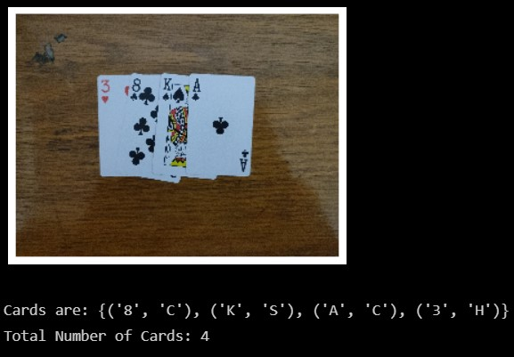
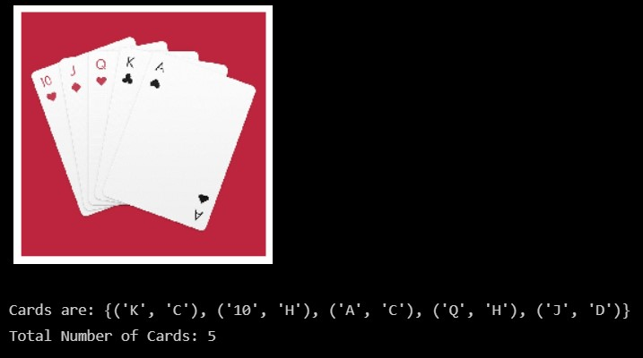

<h1 align="center">
  Coach-ina
</h1>
 
<p align="center">
  <b> A playing cards cross-platform application that coaches you in your game and suggests the best move!
 </b>
   <a style="text-decoration:none" >
    
  </a>
</p>

<p align="center">
  <a style="text-decoration:none" >
    
  </a>
  <a style="text-decoration:none" >
    
  </a>
    <a style="text-decoration:none" >
    
  </a>
  <a style="text-decoration:none" >
    
  </a>
</p>
<hr/>


## Demo

https://user-images.githubusercontent.com/56788883/154695744-95fc1fa8-c6bf-4388-b01b-248c7436c32b.mp4

> It currently sypports two games: "Kings" and "Ground Similarity".

### Detecting the Cards

<div >
  <p  align="center">
    
    
  </p>
  </div>

## Installation of the requirements:

```
pip3 install -r requirements.txt
```

## Running the code:

```
python3 integration.py
```

# Description

Smart Card Game: The main idea of the project is to build a program that helps you win a card game, all you have to do is to send two images one for the cards in the ground and another one for the cards in your hand and the program will indicate the most promising move to take.

Our application has 2 main pipelines, one for hand cards and the other one is for ground cards. User chooses through the application which type of cards it is that they will take a picture of.

```
             -> Ground: Non-overlapping Detection -|
Image     -> |                                     -> KNN Model -|
From App     -> Hand: Overlapping Detection —------|             |
                                                                 |
Best Move Shown On App <- Game Logic <- Matching Suits to Ranks <-
```

## Card Detection Pipeline

0. Image Enhancement: Convert to grayscale and then Gaussian Filter.

_`(Only on Non-overlapping Cards):`_

If it is a ground cards image:

1. Segmentation: Otsu’s Thresholding.
2. Contour Detection.
3. Contour Approximation and Filtering: Approximates contours to a low number of points, filters 4-point contours by angles and area, then, sorts 4-point to get the right orientation of each card.
4. Inverse Perspective Transformation: to get an image of each card.
5. Cropping to get the top left corner: separates rank and suit, then a contour detection is applied and the largest area contour is selected for each of the rank and suit. This output is delivered to the model.

_`(Handling Overlaps):`_

If it is a hand cards image:

1. Segmentation: Otsu’s Thresholding
2. Contour Detection.
3. Contour Filtering:

- Filter out too large or too small contours relative to image area
- Filter out contours with too high or low aspect ratio
- Filter out contours with too low number of points relative to image
  perimeter
- For contours inside of others, only one of the outside or inside contours is  
   selected based on area ratio.

4. For each passing contour: the original image is cropped to contour bounding box, thresholding is applied, checks for number of connected components in cropped image via **DFS** and number of black pixels in these components. These computations are used to filter out some Noise and textures.

## Learning Model

We tried several ML algorithms to classify the detected symbols.
The data was manually collected and augmentation techniques were used to overcome data shortage problems.

1. KNN: the chosen algorithm as it has the least training time and resulted in the highest accuracy.
2. SVM: we have tried using SVM but the model took too much time to train and resulted in some sort of overfitting.
3. Random Forest: same issues as SVM.

## Matching Classified Symbols

A simple matching algorithm is implemented that matches each classified rank with the classified suit closest to it (Euclidean distance between centroids).

## Game Logic

We implemented 2 game logic systems to return the next move for the player:

1. Kings Game: Matches pairs of cards of the same rank and returns a list of pairs (عملية التفنيط في لعبة الشايب)
2. Hand Ground Matcher: Returns the max score card to be played from hand on a card on the ground, a max score is defined as the sum of ranks of two cards from the same suit, if no suits coincide between hand and ground, returns an empty pair.

## Application:

1. Mobile Application using Flutter, for the Game, when the user enters the game, it choose the Game mode between two modes: King, and Hand Ground Matcher, then it will be navigated to the Game Page, it upload hand image in case of king, and hand, and ground images on case of hand ground matcher, and it get the best thing to play.
2. Backend: Implemented using Flask API, gets the images, and game type, and returns the best move.
3. Docker: Containerized using Docker.
4. Google Cloud Platform VM instance for deploying the model.

## Project Structure

```
.
├── dataSet
│   ├── image_change.py
│   ├── testData
│   │   ├── 0.jpeg
│   │   ├── -------
│   │   └── 9.jpeg
│   └── trainData
│       ├── 2
│       │   ├── 2C0.jpg
|       |   |------------
│       │   └── 2S9.jpg
|       |   |------------
|       ├── 10
│       │   ├── 10C0.jpg
|       |   |------------
│       │   └── 10S9.jpg
│       ├── A
│       │   ├── AC0.jpg
|       |   |------------
│       │   └── QH7.jpg
│       ├── J
│       │   ├── JC0.jpg
|       |   |------------
│       │   └── JS47.jpg
│       ├── K
│       │   ├── KC0.jpg
|       |   |------------
│       │   └── KS9.jpg
│       ├── Q
│       │   ├── QC0.jpg
|       |   |------------
│       │   └── QS9.jpg
│       └── spade
│           ├── 10S0.jpg
|           |------------
│           └── QS9.jpg
├── find-card.ipynb
├── frontend
│   └── coachina
│       └── coachina
│           ├── analysis_options.yaml
│           ├── android
│           │   ├── app
│           │   │   ├── build.gradle
│           │   │   └── src
│           │   │       ├── debug
│           │   │       │   └── AndroidManifest.xml
│           │   │       ├── main
│           │   │       │   ├── AndroidManifest.xml
│           │   │       │   ├── kotlin
│           │   │       │   │   └── com
│           │   │       │   │       └── example
│           │   │       │   │           └── coachina
│           │   │       │   │               └── MainActivity.kt
│           │   │       │   └── res
│           │   │       │       ├── drawable
│           │   │       │       │   └── launch_background.xml
│           │   │       │       ├── drawable-v21
│           │   │       │       │   └── launch_background.xml
│           │   │       │       ├── mipmap-hdpi
│           │   │       │       │   └── ic_launcher.png
│           │   │       │       ├── mipmap-mdpi
│           │   │       │       │   └── ic_launcher.png
│           │   │       │       ├── mipmap-xhdpi
│           │   │       │       │   └── ic_launcher.png
│           │   │       │       ├── mipmap-xxhdpi
│           │   │       │       │   └── ic_launcher.png
│           │   │       │       ├── mipmap-xxxhdpi
│           │   │       │       │   └── ic_launcher.png
│           │   │       │       ├── values
│           │   │       │       │   └── styles.xml
│           │   │       │       └── values-night
│           │   │       │           └── styles.xml
│           │   │       └── profile
│           │   │           └── AndroidManifest.xml
│           │   ├── build.gradle
│           │   ├── gradle
│           │   │   └── wrapper
│           │   │       └── gradle-wrapper.properties
│           │   ├── gradle.properties
│           │   └── settings.gradle
│           ├── ios
│           │   ├── Flutter
│           │   │   ├── AppFrameworkInfo.plist
│           │   │   ├── Debug.xcconfig
│           │   │   └── Release.xcconfig
│           │   ├── Podfile
│           │   ├── Podfile.lock
│           │   ├── Runner
│           │   │   ├── AppDelegate.swift
│           │   │   ├── Assets.xcassets
│           │   │   │   ├── AppIcon.appiconset
│           │   │   │   │   ├── Contents.json
│           │   │   │   │   ├── Icon-App-1024x1024@1x.png
│           │   │   │   │   ├── -------------------------
│           │   │   │   │   ├── Icon-App-76x76@2x.png
│           │   │   │   │   └── Icon-App-83.5x83.5@2x.png
│           │   │   │   └── LaunchImage.imageset
│           │   │   │       ├── Contents.json
│           │   │   │       ├── LaunchImage@2x.png
│           │   │   │       ├── LaunchImage@3x.png
│           │   │   │       ├── LaunchImage.png
│           │   │   │       └── README.md
│           │   │   ├── Base.lproj
│           │   │   │   ├── LaunchScreen.storyboard
│           │   │   │   └── Main.storyboard
│           │   │   ├── Info.plist
│           │   │   └── Runner-Bridging-Header.h
│           │   ├── Runner.xcodeproj
│           │   │   ├── project.pbxproj
│           │   │   ├── project.xcworkspace
│           │   │   │   ├── contents.xcworkspacedata
│           │   │   │   └── xcshareddata
│           │   │   │       ├── IDEWorkspaceChecks.plist
│           │   │   │       └── WorkspaceSettings.xcsettings
│           │   │   └── xcshareddata
│           │   │       └── xcschemes
│           │   │           └── Runner.xcscheme
│           │   └── Runner.xcworkspace
│           │       ├── contents.xcworkspacedata
│           │       └── xcshareddata
│           │           ├── IDEWorkspaceChecks.plist
│           │           └── WorkspaceSettings.xcsettings
│           ├── lib
│           │   ├── generated_plugin_registrant.dart
│           │   ├── main.dart
│           │   └── src
│           │       └── logic
│           │           └── game_controller
│           │               └── game_controller.dart
│           ├── macos
│           │   ├── Flutter
│           │   │   ├── Flutter-Debug.xcconfig
│           │   │   ├── Flutter-Release.xcconfig
│           │   │   └── GeneratedPluginRegistrant.swift
│           │   ├── Podfile
│           │   ├── Runner
│           │   │   ├── AppDelegate.swift
│           │   │   ├── Assets.xcassets
│           │   │   │   └── AppIcon.appiconset
│           │   │   │       ├── app_icon_1024.png
│           │   │   │       ├── ------------------
│           │   │   │       └── Contents.json
│           │   │   ├── Base.lproj
│           │   │   │   └── MainMenu.xib
│           │   │   ├── Configs
│           │   │   │   ├── AppInfo.xcconfig
│           │   │   │   ├── Debug.xcconfig
│           │   │   │   ├── Release.xcconfig
│           │   │   │   └── Warnings.xcconfig
│           │   │   ├── DebugProfile.entitlements
│           │   │   ├── Info.plist
│           │   │   ├── MainFlutterWindow.swift
│           │   │   └── Release.entitlements
│           │   ├── Runner.xcodeproj
│           │   │   ├── project.pbxproj
│           │   │   ├── project.xcworkspace
│           │   │   │   └── xcshareddata
│           │   │   │       └── IDEWorkspaceChecks.plist
│           │   │   └── xcshareddata
│           │   │       └── xcschemes
│           │   │           └── Runner.xcscheme
│           │   └── Runner.xcworkspace
│           │       ├── contents.xcworkspacedata
│           │       └── xcshareddata
│           │           └── IDEWorkspaceChecks.plist
│           ├── pubspec.lock
│           ├── pubspec.yaml
│           ├── README.md
│           ├── test
│           │   └── widget_test.dart
│           └── web
│               ├── favicon.png
│               ├── icons
│               │   ├── Icon-192.png
│               │   ├── Icon-512.png
│               │   ├── Icon-maskable-192.png
│               │   └── Icon-maskable-512.png
│               ├── index.html
│               └── manifest.json
├── Game Logic
│   ├── HandGroundMatcher.py
│   └── Kings.py
├── Grouping
│   ├── GroundRemoval.ipynb
│   ├── imgs
│   │   ├── 0.jpg
│   |   |-----------
│   │   └── 9.jpg
│   └── RandomImages
│       ├── 1200px-7_playing_cards.jpg
|       |   --------------------------
│       └── st040.jpg
├── integration.py
├── LICENSE
├── Model
│   ├── dataSet
│   │   └── trainData
│   │       ├── 2
│   │       │   ├── 2C0.jpg
|   │       |   |------------
│   │       │   └── 2S9.jpg
|   │       |   |------------
|   │       ├── 10
│   │       │   ├── 10C0.jpg
|   │       |   |------------
│   │       │   └── 10S9.jpg
│   │       ├── A
│   │       │   ├── AC0.jpg
|   │       |   |------------
│   │       │   └── QH7.jpg
│   │       ├── J
│   │       │   ├── JC0.jpg
|   │       |   |------------
│   │       │   └── JS47.jpg
│   │       ├── K
│   │       │   ├── KC0.jpg
|   │       |   |------------
│   │       │   └── KS9.jpg
│   │       ├── Q
│   │       │   ├── QC0.jpg
|   │       |   |------------
│   │       │   └── QS9.jpg
│   │       └── spade
│   │           ├── 10S0.jpg
|   │           |------------
│   │           └── QS9.jpg
│   ├── dataSet.zip
│   ├── KNN_model.joblib
│   ├── Models
│   │   ├── KNN_model.joblib
│   │   ├── rf_model.joblib
│   │   └── SVC_model.joblib
│   └── modelTrain.py
├── model.ipynb
├── __pycache__
│   ├── integration.cpython-39.pyc
│   └── utilities.cpython-39.pyc
├── README.md
├── requirments.txt
├── Screenshots
│   ├── testCase1.jpg
│   └── testCase2.jpg
├── server
│   ├── app.py
│   ├── Dockerfile
│   ├── model.joblib
│   ├── model.py
│   ├── req.txt
│   ├── requirments.txt
│   ├── rf_model.joblib
│   ├── server_files
│   │   ├── app.py
│   │   ├── Dockerfile
│   │   ├── model.py
│   │   ├── requirments.txt
│   │   └── rf_model.joblib
│   └── SVC_model.joblib
├── TestCases
│   ├── NonOverLapping
│   │   ├── 10.jpeg
│       -----------
│   │   └── 9.jpeg
│   └── OverLapping
│       ├── 10.jpeg
│       -----------
│       ├── 8.jpeg
│       └── 9.jpeg
└── utilities.py
110 directories, 4764 files
```

## Papers references

1- Hands on Machine Learning with Scikit-learn, keras, and tensorflow textbook, Chapter 5 Support Vector Machines.

2- Single-image Background Removal with Entropy Filtering Paper.

3- G. Kumar and P. K. Bhatia, "A Detailed Review of Feature Extraction in Image Processing Systems," 2014 Fourth International Conference on Advanced Computing & Communication Technologies, 2014, pp. 5-12, doi: 10.1109/ACCT.2014.74.
